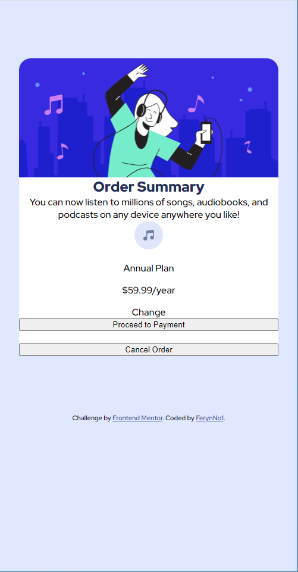

# Frontend Mentor - Order summary card solution

This is a solution to the [Order summary card challenge on Frontend Mentor](https://www.frontendmentor.io/challenges/order-summary-component-QlPmajDUj). Frontend Mentor challenges help you improve your coding skills by building realistic projects. 

## Table of contents

- [Overview](#overview)
  - [The challenge](#the-challenge)
  - [My process](#my-process)
  - [Built with](#built-with)
  - [Author](#author)

### Overview

### The challenge

Users should be able to:

- See hover states for interactive elements

### Links

- Solution URL: [https://frontend-mentor-order-summary-seven.vercel.app/)

## My process

Saturday, September 18th, 2021

10:26 AM EST:
This is my first Frontend Mentor project. I'm not quite sure what to expect and how easy or hard it will be. But let's give it a go.

11:47 AM EST:
Finally got Git to work. First time setting up Git Repo. Still not really comfortable using branches, commits, pushes aso. Started structuring the HTML now.

11:59 AM EST:

12:30 PM EST:

03:28 PM EST:
Had a  break. I'm pretty satisfied with how the order summary is looking now. It is not 100% correct, but we are getting really close. I feel a little like the way I wrote my css is completely wrong and all the hardcore devs reading it will be like: "oooh duude wtf." But hey, still learning - like I said I'm pretty satisfied.

03:43 PM EST:
Kinda finished. Sure there could be a little bit of tweaking but yeah. Spend a few hours on it, pretty proud that I managed to do this project without having to look up too much and didn't need that much time. So even if it's not 100% the way it should be, personally I see that as finished for my practice session today. :-)

### Built with

- HTML5
- CSS
- Using VS Code

## Author

- Frontend Mentor - [@FerynNo1](https://www.frontendmentor.io/profile/FerynNo1)
- GitHub - [@Feryn](https://github.com/FerynNo1)

